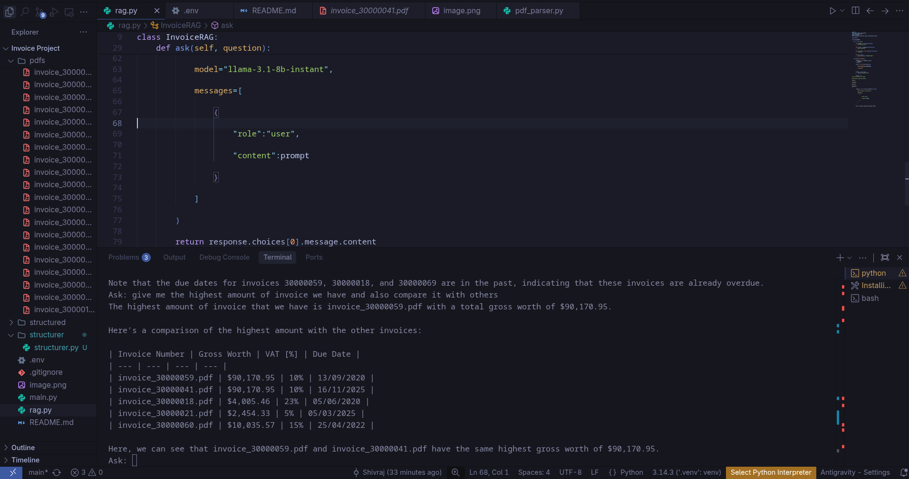
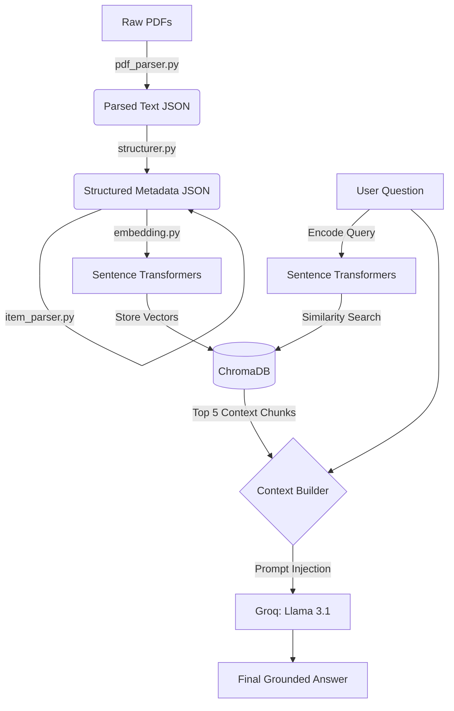

# Hybrid Invoice RAG Chatbot



A Retrieval-Augmented Generation (RAG) pipeline designed to extract, structure, and query data from a collection of PDF invoices. 

The system leverages Llama 3.1 (via the Groq API) for answering queries, ChromaDB for vector storage, and Sentence Transformers (`all-MiniLM-L6-v2`) for generating embeddings.

---

## Key Features

* **Automated PDF Ingestion:** Page-by-page text extraction from invoice PDFs.
* **Structured Data Extraction:** Parses and maps unstructured text into defined fields like dates, sellers, and clients.
* **Line Item Tokenization:** Extracts itemized rows, matching quantity, units, net price, VAT, and gross totals.
* **Vector Indexing:** Generates semantic embeddings of structured invoices and indexes them in a local ChromaDB store.
* **Grounded Question Answering:** Retrieves context-relevant invoice sections to answer user queries accurately.

---

## System Architecture



---

## Core Code Snippets

### 1. PDF Text Extraction
Reads text from raw documents page-by-page using `pypdf`:
```python
# parser/pdf_parser.py
reader = PdfReader(pdf_path)
pages = [{"page": i, "text": page.extract_text() or ""} 
         for i, page in enumerate(reader.pages, start=1)]
```

### 2. Segment and Field Isolation
Extracts specific fields and blocks of text using regex bounds:
```python
# structurer/structurer.py
invoice_number = re.search(r"Invoice no:\s*(.*)", text).group(1)
seller_details = re.search(r"Seller:(.*?)Client:", text, re.DOTALL).group(1)
```

### 3. Line-Item Parsing
Identifies and tokenizes individual table rows by capturing list identifiers and splitting numeric strings:
```python
# item_parserer/item_parser.py
# Split block using item numbers (e.g., "1.", "2.")
blocks = re.split(r"\n(?=\d+\.)", items_text)

# Tokenize numeric values from the last line of a block
tokens = numeric_line.split()
qty, unit = tokens[0], tokens[1]
vat = next(t for t in tokens if "%" in t)
gross_worth = " ".join(tokens[tokens.index(vat) + 1:])
```

### 4. Database Ingestion
Computes embeddings and saves the structured payload along with metadata:
```python
# embeddings/embedding.py
embedding = self.model.encode(json.dumps(invoice_json)).tolist()
self.collection.add(
    ids=[str(doc_id)],
    documents=[json_text],
    embeddings=[embedding],
    metadatas=[{"invoice_number": num, "filename": name}]
)
```

### 5. Semantic Retrieval
Queries ChromaDB to gather the top five most relevant context blocks:
```python
# rag.py
embedding = self.embedder.encode(question).tolist()
results = self.collection.query(query_embeddings=[embedding], n_results=5)
context = "\n\n".join(results["documents"][0])
```

### 6. Grounding Prompt
Restricts the language model's responses to the retrieved invoice context:
```python
# rag.py
prompt = f"""You are an invoice assistant. Answer ONLY using the context.
Context:
{context}

Question:
{question}"""
```

---

## Setup and Installation

### 1. Install Dependencies
Ensure you have all the required Python packages installed:
```bash
pip install pypdf sentence-transformers chromadb groq python-dotenv streamlit
```

### 2. Configure API Key
Create a `.env` file in the root directory and add your Groq API credentials:
```env
GROQ_API_KEY=gsk_your_api_key_here
```

### 3. Run the Application
You can interact with the chatbot using either the web-based Streamlit interface or the CLI:

* **Streamlit Web App:**
  ```bash
  streamlit run app.py
  ```

* **Command Line Interface:**
  ```bash
  python main.py
  ```
